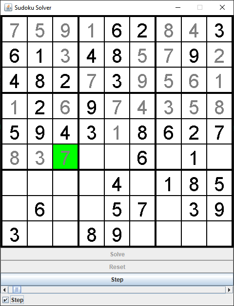

# Sudoku Solver

One of the algorithms used to solve sudoku puzzles operates via the concept of recursive-backtracking. When teaching this programming concept, its application in solving sudokus is often used. 

This program is primarily designed to help visualise the recursive-backtracking process, allowing users to go through the process step-by-step; however, a user can also solve sudokus manually via the UI.

# Language

Sudoku Solver was coded and run in Java (v. 2021-12, 4.22.0).

# Instructions

1. Either (a) clone or (b) download and extract the repository to the root folder of an empty Java project.
2. Select/create a file that contains the sudoku you wish to solve (see the example .txt files for the required format). You must copy the name of this file (incl. extension) and use it as the argument of the SudokuFrame object's a_file_sudoku parameter (in MainSudokuSolver.java).
3. Compile and run.

# Screenshot

